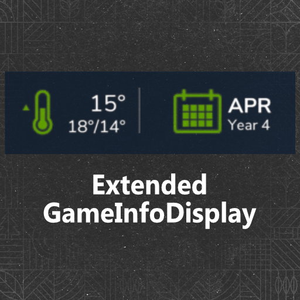
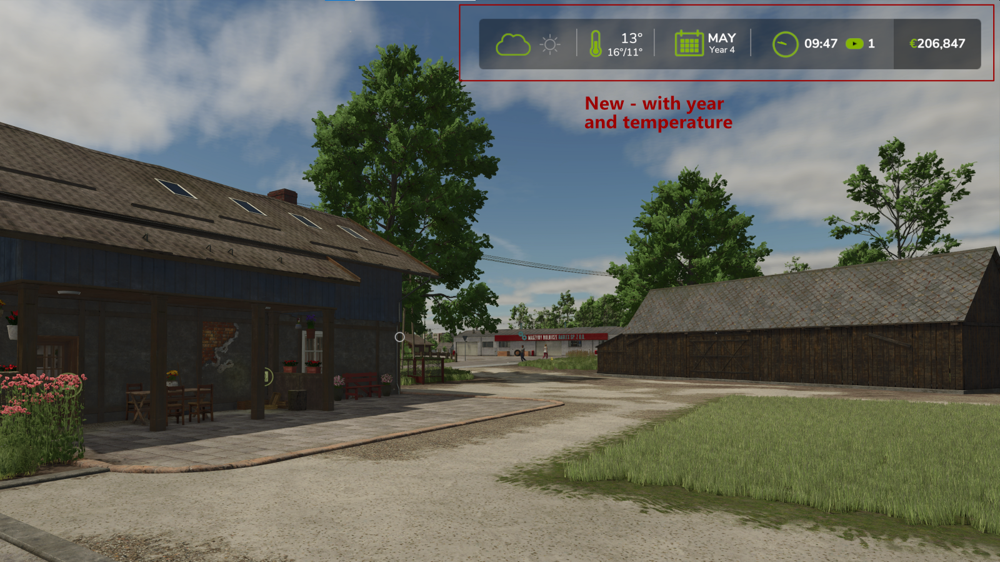

 

<h3 align="center"><u>FS25_ExtendedGameInfoDisplay</u></h3>

    Expands the current GameInfoDisplay in the upper right corner by displaying the current year under the date and activates a temperature feature with an indicator of whether the temperature is falling, staying constant or rising, the display of the current temperature. I also added the min/max temperature of the day.

    

## Credits
* Woeller ([Youtube](https://www.youtube.com/@woeller))
* Sqeep

# Copyright
Copyright (c) 2024 [Dennis Schmitt](https://github.com/peppie84).
All rights reserved.

(<a href="#readme-top">back to top</a>)
